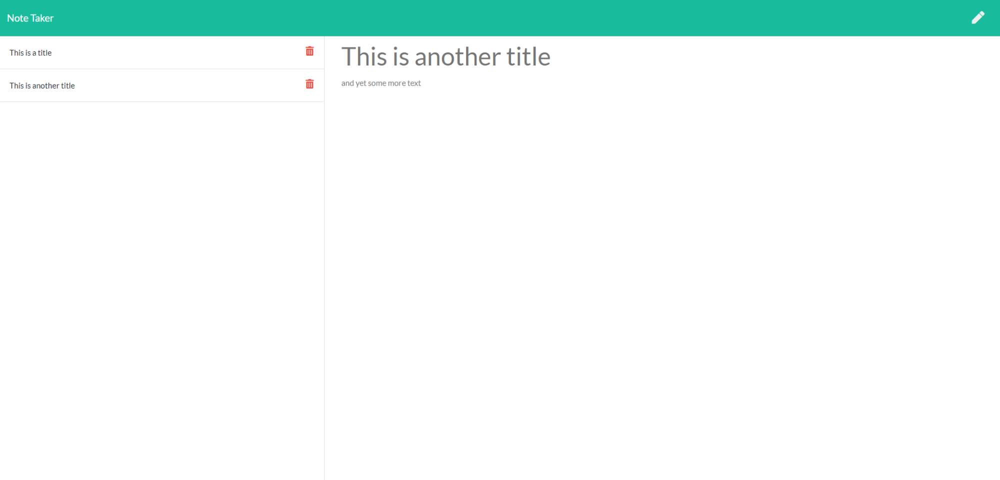

# Note Were Thee

## Description

This repo contains a nodejs based app that allows a user to create and delete notes. Note fields allow the user to input both a title and a body text that are stored with a unique id based on the time that the note was saved.

## Table of Contents

* [Installation](#installation)

* [Usage](#usage)

* [Credits](#credits)

* [License](#license)

 

* Displays a splash screen for the app
* Notes page shows saved notes and displays the active note
* Allows user to create a new note and save to the list on the left hand side
* Allows user to delete previous saved notes

 

This note taking app is intended to allow a user to organize their thoughts and goals in an easy to use and maintain format.

 

[Note Were Thee](https://note-were-thee.herokuapp.com/)

***

## Installation

To run Note Were Thee, either follow the link above or you can copy/clone/fork this repository. Make sure to install the Express, Uniqid, and fs libraries. "npm init" to intialiaze the package manager followed by "npm install {dependency}". This will setup the necesary packages required.

***

## Usage

This application is used to create daily notes to help one organize their tasks at hand. The interface is clean and simple allowing a streamlined interaction which is preferrable when time is of the essence. Click throuh the splach screen to enter the note taking application and generate as many notes as you wish. Each note is created with a unique custom id based on the current time to prevent any mixups.

 

***

## Credits

W3Schools for always being there | 
[W3Schools](https://www.w3schools.com/)

 

***

## License

All Rights Reserved.
